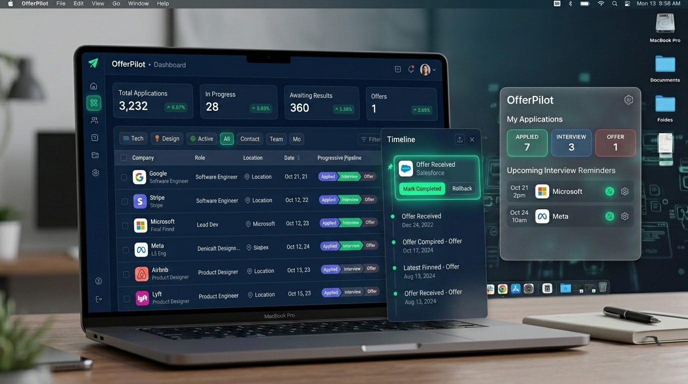
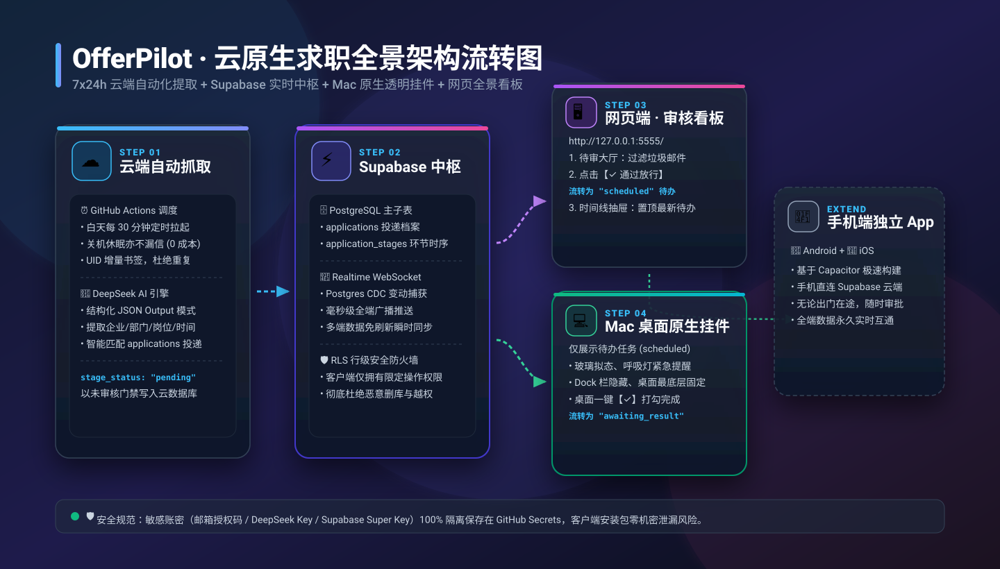
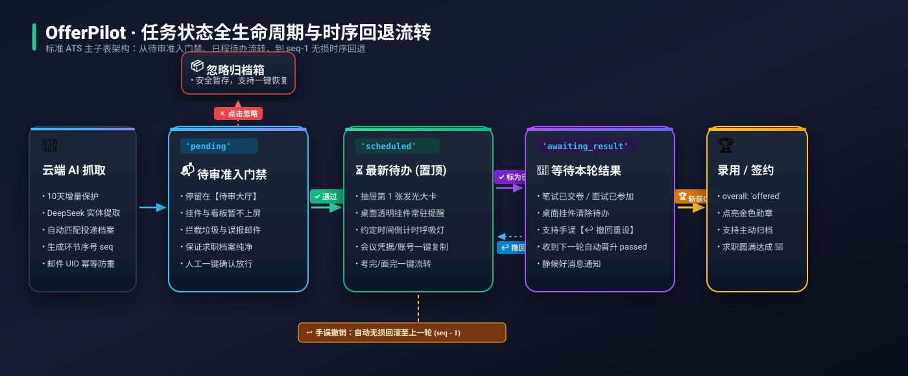

<div align="center">

# OfferPilot · 求职全景智能助手

**云原生 · 高颜值 · 多端实时同步的个人求职全流程自动化管理体系**

[](LICENSE)
[](https://www.python.org/)
[](https://supabase.com/)
[](https://www.deepseek.com/)
[]()
[](.github/workflows/sync.yml)

<br/>



<br/>

[🌟 核心特性](#-核心特性) • [📐 系统架构全景](#-系统架构全景) • [☁️ 云端底座部署](#-从零到一新手极速部署指南-fork-零代码模式) • [🖥️ Mac 桌面端教程](#️-主线一mac-桌面端使用教程-macos-desktop-widget) • [🪟 Windows 电脑端教程](#-主线二windows-电脑端使用教程-windows-web-hub) • [📱 手机移动端教程](#-主线三手机移动端使用教程-mobile--android) • [📂 工程目录结构](#-工程目录结构) • [🔒 安全架构](#-开源安全与机密隔离)

</div>

---

## 📖 项目简介

**OfferPilot (求职全景智能助手 V3.4)** 专为求职季打造，自动化聚合分散在各大邮箱中的笔试与面试通知，实现 **“云端 7x24h 静默抓取 + Mac 桌面透明挂件 + Windows 极简双击看板 + Android 原生移动端”** 的全端无缝协同闭环。

---

## 🌟 核心特性

<table width="100%">
  <tr>
    <td width="50%" valign="top">
      <h4>🗄️ 标准 ATS 双层求职架构</h4>
      <p>主表与环节子表物理隔离，各轮次时序归档，动态真实步进条 100% 按企业实际环节呈现。</p>
    </td>
    <td width="50%" valign="top">
      <h4>📱 Android 原生与多端公网部署</h4>
      <p>支持 Capacitor 原生打包为 APK 独立运行，支持 Netlify / Vercel 免费托管添加到手机桌面。</p>
    </td>
  </tr>
  <tr>
    <td width="50%" valign="top">
      <h4>✨ 奶油琥珀流光 & 白瓷双主题</h4>
      <p>内置「经典温润白瓷」与「奶油琥珀流光」双主题，发光轨道、气泡对话卡片与触感微震动。</p>
    </td>
    <td width="50%" valign="top">
      <h4>🪟 Windows 极简双击即开</h4>
      <p>根目录提供双击启动脚本，自动拉起默认浏览器呈现宽屏全景看板，网页端直接配置数据库。</p>
    </td>
  </tr>
</table>

---

## 📐 系统架构全景



---

## 🛠️ 从零到一新手极速部署指南 (Fork 零代码模式)

> 💡 **无需本地配置复杂的 Python 开发环境，无需手动敲 Git 命令上传代码！**  
> 只要在网页上点击 **【Fork】一键派生**，即可立刻激活专属于您个人的 7x24h 云端抓取机器人！


---

### 🌟 阶段一：准备三大免费云端平台密钥 (约 2 分钟)

#### 1. 📧 获取邮箱 IMAP 授权码与服务器信息

本项目支持 **QQ 邮箱、腾讯企业邮箱（企业微信邮箱）、网易 163 邮箱** 等所有支持标准 IMAP 协议的邮箱服务：

<details open>
<summary><b>🔹 选项 A：个人 QQ 邮箱（最常用）</b></summary>

1. 网页端登录 [QQ 邮箱 (mail.qq.com)](https://mail.qq.com/) ➡️ 点击上方 **【设置】** ➡️ **【账户】**；
2. 向下滚动找到 **POP3/IMAP/SMTP/Exchange/CardDAV/CalDAV服务**；
3. 开启 **`POP3/SMTP服务`** 与 **`IMAP/SMTP服务`**；
4. 点击 **【生成授权码】**，按提示发送短信即可获取一段 **16 位字母授权码**（作为 `EMAIL_AUTH_CODE`）；
5. 默认 IMAP 服务器为 `imap.qq.com`（无需额外配置 `IMAP_SERVER`）。
</details>

<details>
<summary><b>🔹 选项 B：腾讯企业邮箱 / 企业微信邮箱</b></summary>

1. **开启 IMAP 协议**：电脑浏览器登录 [腾讯企业邮箱网页版 (exmail.qq.com)](https://exmail.qq.com/) ➡️ 点击右上角 **【设置】** ➡️ **【收发信设置】** ➡️ 开启 **POP3/IMAP 客户端服务协议** 并保存；
   > 💡 *注：若无法勾选，需企业管理员在企业微信管理后台【协作 ➡️ 邮件 ➡️ 安全管理 ➡️ 客户端访问权限】开启权限。*
2. **生成专用密码**：进入 **【设置】** ➡️ **【邮箱绑定 / 安全登录】** ➡️ 找到 **【客户端专用密码】** 点击生成（作为 `EMAIL_AUTH_CODE`，开启双重验证后**不能**使用网页密码）；
3. **IMAP 服务器**：在 GitHub Secrets 中添加 `IMAP_SERVER` 为 **`imap.exmail.qq.com`**（信创版填 `xcimap.exmail.qq.com`）。
</details>

<details>
<summary><b>🔹 选项 C：网易 163 邮箱</b></summary>

1. 网页端登录 [网易 163 邮箱 (mail.163.com)](https://mail.163.com/) ➡️ 点击上方 **【设置】** ➡️ **【POP3/SMTP/IMAP】**；
2. 勾选开启 **POP3/SMTP 服务** 与 **IMAP/SMTP 服务**；
3. 点击 **【新增授权密码】**，完成短信验证后获取授权码；
4. **IMAP 服务器**：在 GitHub Secrets 中添加 `IMAP_SERVER` 为 **`imap.163.com`**。
</details>

#### 2. 🤖 获取 DeepSeek AI API Key
* 登录 [DeepSeek 开放平台](https://platform.deepseek.com/) ➡️ 进入 **【API Keys】**；
* 点击 **【创建 API key】**，复制生成的以 `sk-` 开头的密钥字符串（新用户赠送免费 Token，解析几千封邮件仅需几毛钱）。

#### 3. ⚡️ 创建免费 Supabase 云数据库 (1分钟搞定)
* 登录 [Supabase 官网](https://supabase.com/)，点击 **【New Project】** 创建一个免费数据库项目；
* 进入项目左侧导航栏的 **【SQL Editor】**，粘贴以下一键初始化建表代码并点击 **【Run】**：

```sql
-- 1. 清理旧表 (全新部署时执行)
DROP TABLE IF EXISTS tasks CASCADE;
DROP TABLE IF EXISTS application_stages CASCADE;
DROP TABLE IF EXISTS applications CASCADE;
DROP TABLE IF EXISTS sync_state CASCADE;

-- 2. 创建求职投递单主表 (Applications)
CREATE TABLE applications (
    id UUID PRIMARY KEY DEFAULT gen_random_uuid(),
    company TEXT NOT NULL,
    department TEXT DEFAULT '',
    position TEXT NOT NULL,
    recruitment_season TEXT DEFAULT '2027届秋招',
    current_stage_name TEXT DEFAULT '网申提交',
    overall_status TEXT DEFAULT 'active', -- active(推进中) | offered(已录用) | failed(已结束) | archived(已归档)
    created_at TIMESTAMPTZ DEFAULT NOW(),
    updated_at TIMESTAMPTZ DEFAULT NOW()
);

-- 3. 创建环节流转明细子表 (Application Stages)
CREATE TABLE application_stages (
    id UUID PRIMARY KEY DEFAULT gen_random_uuid(),
    application_id UUID NOT NULL REFERENCES applications(id) ON DELETE CASCADE,
    seq INT NOT NULL DEFAULT 1, -- 环节时序序号 (1, 2, 3...)
    stage_name TEXT NOT NULL,
    stage_status TEXT DEFAULT 'pending', -- pending(待审) | scheduled(待办) | awaiting_result(待结果) | passed(通过) | failed(未通过) | ignored(忽略)
    schedule_time TEXT DEFAULT '待定',
    meeting_info TEXT DEFAULT '',
    next_expectation TEXT DEFAULT '',
    raw_email_id TEXT DEFAULT '', -- 邮件 UID 幂等防重
    raw_subject TEXT DEFAULT '',
    notes TEXT DEFAULT '',
    created_at TIMESTAMPTZ DEFAULT NOW(),
    updated_at TIMESTAMPTZ DEFAULT NOW()
);

-- 4. 创建增量同步书签表 (初始化从最近 10 天开始扫描)
CREATE TABLE sync_state (
    key TEXT PRIMARY KEY,
    last_uid BIGINT DEFAULT 0,
    updated_at TIMESTAMPTZ DEFAULT NOW()
);
INSERT INTO sync_state (key, last_uid) VALUES ('email_sync', 0);

-- 5. 创建高性能索引
CREATE INDEX idx_stages_app_seq ON application_stages(application_id, seq DESC);
CREATE INDEX idx_stages_status ON application_stages(stage_status);
CREATE INDEX idx_app_company ON applications(company, department, position);

-- 6. 开启 WebSocket Realtime 实时全端推流
ALTER PUBLICATION supabase_realtime ADD TABLE applications;
ALTER PUBLICATION supabase_realtime ADD TABLE application_stages;

-- 7. 开启 RLS 行级安全策略 (保障公网公开访问安全)
ALTER TABLE applications ENABLE ROW LEVEL SECURITY;
ALTER TABLE application_stages ENABLE ROW LEVEL SECURITY;
ALTER TABLE sync_state ENABLE ROW LEVEL SECURITY;
CREATE POLICY "Allow public all applications" ON applications FOR ALL USING (true) WITH CHECK (true);
CREATE POLICY "Allow public all application_stages" ON application_stages FOR ALL USING (true) WITH CHECK (true);
CREATE POLICY "Allow public read sync_state" ON sync_state FOR ALL USING (true) WITH CHECK (true);
```

* 进入项目 **Project Settings ➡️ API**，复制以下 3 个核心凭证：
  * **Project URL**（如 `https://xxxx.supabase.co`）
  * **`anon` `public` key**（客户端公开公钥，如 `sb_publishable_...`）
  * **`service_role` `secret` key**（云端超级写入私钥，如 `sb_secret_...`）

---

### ☁️ 阶段二：在 GitHub 网页一键 Fork 并激活云端机器人 (约 2 分钟)

```
[ 本项目 GitHub 主页 ]
         ⬇️ 点击右上角【Fork】按钮 (一键派生到个人账号)
[ 属于您自己的个人仓库: 你的用户名/OfferPilot ]
         ⬇️ 配置机密 Secrets 凭据
[ 🎉 您的专属云端大脑开始 7x24h 自动工作！]
```

1. **一键 Fork 仓库**：
   * 打开本项目 GitHub 页面，点击右上角的 **【Fork】** 按钮，按默认设置点击 **【Create fork】**；
2. **填入机密密钥 (Secrets)**：
   * 在您刚刚 Fork 出来的个人仓库中，点击顶部 **【Settings】** ➡️ 左侧菜单 **【Secrets and variables】** ➡️ **【Actions】**；
   * 点击绿色的 **【New repository secret】**，依次添加以下机密参数：

| 机密名称 (Secret / Variable) | 是否必填 | 应该填入的值 (Value) | 来源说明 |
| :--- | :---: | :--- | :--- |
| **`EMAIL_USER`** | 必填 | 您的邮箱完整地址（如 `12345678@qq.com` 或 `hr@company.com`） | 邮箱账号 |
| **`EMAIL_AUTH_CODE`** | 必填 | 邮箱生成的 IMAP 授权码或客户端专用密码 | 邮箱鉴权密码 |
| **`DEEPSEEK_API_KEY`** | 必填 | 以 `sk-` 开头的 DeepSeek API Key | AI 提取模型密钥 |
| **`SUPABASE_URL`** | 必填 | Supabase 项目 Project URL | 数据库 HTTPS 地址 |
| **`SUPABASE_SERVICE_ROLE_KEY`** | 必填 | Supabase 的 `service_role` secret key | 数据库超级写私钥 |
| **`IMAP_SERVER`** | 选填 | 如 `imap.exmail.qq.com`（腾讯企业邮）或 `imap.163.com` | 不填默认 `imap.qq.com` |
| **`DEEPSEEK_API_BASE`** | 选填 | 如第三方 AI 代理地址 `https://api.your-proxy.com` | 不填默认官方 `https://api.deepseek.com` |
| **`DEEPSEEK_MODEL`** | 选填 | 如 `deepseek-chat` | 不填默认 `deepseek-chat` |

> [!TIP]
> 💡 **配置小贴士**：
> 1. **前 5 项必填机密**请在 **【Secrets】** 标签页下添加（保存后自动加密打码）；
> 2. **选填参数**（如 `IMAP_SERVER`、`DEEPSEEK_API_BASE`、`DEEPSEEK_MODEL`）既可以添加在 **【Secrets】** 中，也可以添加在 **【Variables】** 标签页中（方便明文查看与修改）。
> 3. **首次测试云端抓取**：配置完成后，点击仓库顶部的 **【Actions】** 标签 ➡️ 点击左侧的 **Recruitment Email Sync** ➡️ 点击右侧 **【Run workflow】** 即可手动立即触发一次云端抓取。通常 8 秒内即可在 Supabase 看到新邮件入库！


---

## 🖥️ 主线一：Mac 桌面端使用教程 (macOS Desktop Widget)

Mac 桌面端专为日常沉浸办公设计，打造了 **极简毛玻璃透明桌面挂件 + 双击开关控制 + 7x24h 云端静默抓取** 的无感协同体验。

### 1. 📥 下载与安装
1. 在本项目的 **[Releases 发行版页面](https://github.com/MySoulForYou/check-QQEmail-employ/releases)** 下载与你芯片匹配的安装包：Apple Silicon（M 系列）选择文件名含 `macOS-arm64` 的 DMG，Intel 选择文件名含 `macOS-x86_64` 的 DMG。新版内置 Python 和依赖，无需安装开发环境；
2. 双击打开 DMG 镜像，将 **`OfferPilot.app`** 拖拽到系统“应用程序 (Applications)”文件夹中。

> 带 `-unsigned` 后缀的是未经过 Apple 公证的安装包，也可以在 Release 中发布下载；签名完整性通过不等于获得 Apple 信任，首次打开可能被 macOS 拦截。请先确认下载来源，再参考 DMG 内的安装说明；不要关闭全局安全保护。旧版 v3.4.0 的资源签名存在缺陷，重新下载同一旧版附件无法修复。构建、签名和发布配置见 [Mac 打包说明](docs/mac-packaging.md)。

### 2. ⚙️ 首次配置向导 (仅需 30 秒)
1. 首次打开软件，桌面会自动浮现优雅的 **毛玻璃设置向导**；
2. 直接粘贴您的 **Supabase Project URL** 与 **`anon` 公开公钥**，点击【⚡️ 保存并立即连接】；
3. 配置自动持久化保存在 `~/.config/recruitment_assistant/config.json`，软件后续升级覆盖亦不丢配置。

### 3. 🎮 Mac 客户端日常核心交互

按住窗口四周边缘、四个角或左上角“招聘任务”标题区并移动鼠标，即可拖动挂件；无需等待固定长按时间。轻微抖动不会移动窗口，按钮、输入框和内容滚动不参与拖动。Mac 边缘用于移动，不再用于缩放窗口。挂件保持无边框、不置顶和跨桌面显示，采用普通窗口层级以确保鼠标交互；因此可能被其他普通窗口遮挡，不再固定到 Finder 桌面层。
* **🔄 双击开/关机制（极简 Toggle 控制）**：
  * **双击打开**：未运行时双击 `OfferPilot.app`，桌面右上角即刻浮现毛玻璃挂件，本地 Web 管理服务同步拉起，并发送系统通知：`🟢 OfferPilot：已在桌面启动`；
  * **再双击关闭**：运行状态下再次双击 `OfferPilot.app`，系统将**毫秒级彻底退出全部后台 Python 进程与 Web 服务**，并发送通知：`🔴 OfferPilot：已完全关闭`。
* **🖥️ 挂件悬浮与状态流转**：
  * **⚙️ 设置数据库**：点击挂件右上角齿轮，随时呼出配置窗口修改 Supabase 凭据；
  * **📊 全景看板**：点击右上角看板图标，直接在浏览器中打开全景控制台（[http://127.0.0.1:5555/](http://127.0.0.1:5555/)）；
  * **✕ 仅收起挂件**：点击右上角 `✕` 仅隐藏桌面挂件，**后台 Web 管理大厅保持常驻可用**；
  * **✓ 标记完成**：点击待办卡片右侧的勾选按钮，环节状态流转为等待结果并折叠。

---

## 🪟 主线二：Windows 电脑端使用教程 (Windows Web Hub)

Windows 端专为大屏求职管理打造，支持 **“免安装独立 EXE 运行”** 与 **“双击脚本启动”** 双模式，彻底摒弃繁琐环境配置与黑窗口命令。

### 1. 📥 获取与启动方式

#### 方案 A：下载免安装独立 EXE (零配置新手推荐 🌟)
1. 在本项目的 **[Releases 发行版页面](../../releases)** 或 Actions Artifacts 中直接下载 **`OfferPilot-Windows-v3.4.0.exe`**；
2. 双击运行，程序自带轻量运行时，**无需安装 Python**，会自动在 Windows 默认浏览器（Edge / Chrome）中弹出宽屏全景控制台（[http://127.0.0.1:5555/](http://127.0.0.1:5555/)）。

#### 方案 B：源码双击脚本启动 (开发者适用)
1. 克隆/下载本项目到 Windows 电脑；
2. 双击项目根目录下的 **`启动招聘助手.bat`** 即可自动起服并唤起浏览器看板。

### 2. ⚙️ 网页端首次配置 (仅需 10 秒)
1. 首次打开网页时，页面会自动弹出 **「⚙️ Supabase 云数据库配置」** 窗口；
2. 粘贴您的 **Supabase Project URL** 与 **`anon` 公开公钥**；
3. 点击 **【⚡️ 保存并立即连接】**，云端数据秒级呈现并开启 Realtime 实时推流！

### 3. 🎮 核心功能与使用方式
* **宽屏全景看板**：在大屏幕上尽享 **2 列白瓷求职卡片流、4 大 Bento 待办指标与右侧全景时间线抽屉**；
* **邮件审核大厅**：进入“邮件待审准入”大厅，AI 智能提炼的笔面试通知一键审核放行或修改；
* **一键开关控制**：关闭弹出的命令行窗口即可完全停止服务；或双击 `scripts/toggle_windows.bat` 实现一键智能开/关！

---

## 📱 主线三：手机移动端使用教程 (Mobile & Android)

手机移动端专为出门在外随身查看求职进度打造，支持 **全动态真实时序步进条、全景时间专属搜索、白瓷/奶油琥珀双主题与 Haptic 微震动**。即使电脑关机，在 4G/5G 网络下也能秒级同步！

### 1. 📥 获取与安装方式

#### 方案 A：免安装添加到手机主屏幕 (PWA / Web App 推荐，30秒搞定)
1. **访问公网地址**：用安卓或 iPhone 手机浏览器打开已部署的公网链接（如 `https://offerpilot-2026.netlify.app`）；
2. **首次沙盒配置**：点击右下角 **【个人设置】** ➡️ 填入您的 Supabase URL 和 Key 并保存（手机本地沙盒持久化，零泄露风险）；
3. **一键生成桌面 App**：
   * 点击浏览器菜单 ➡️ 选择 **【添加到主屏幕】**（或【安装应用】）；
   * 手机桌面即刻生成 **OfferPilot 独立 App 图标**，全屏沉浸、无浏览器地址栏、支持触感微震动！

#### 方案 B：下载 Android 原生 APK 安装包
* 在 GitHub 仓库的 **【Actions】页面最底部 Artifacts** 或 **【Releases】附件列表** 中直接下载 **`OfferPilot-android-debug.apk`**；
* 发送到安卓手机点击即可直接安装运行。

### 2. 🎮 手机移动端四大核心玩法

* **📊 控制台与全动态真实步进条**：
  * **4 大客观 Bento 指标卡**：待办日程、等待结果、录用意向与终止归档；
  * **6 大流程进度 Filter**：按测评、笔试、面试、Offer 精准过滤；
  * **100% 动态步进条**：彻底废除固定模板，卡片步进条 100% 根据该企业实际收到的真实环节数量与名称动态绘制。
* **🔍 全景时间线深度下钻**：
  * **已建档企业横滑栏**：顶栏仅展示已准入建档的有效企业，横滑快速切换；
  * **专属模糊搜索**：支持公司名、岗位与部门实时搜索与即时定位；
  * **气泡对话框卡片**：白瓷卡片带拟物指示尖角与发光流光轨道，一键复制腾讯会议凭据；
  * **智能滚动记忆**：在全景时间点击左上角 **「← 返回」** 或底部 Tab，系统**精准保留并恢复离开控制台时的滑动位置**，绝不跳回顶部！
* **✏️ 档案与求职环节自由修正**：
  * 点击卡片可自由修正环节名称、时间、会议号与备忘，**直接原地精准覆盖更新原记录，绝不新增多余流转**。
* **🎨 双主题与交互微震动**：
  * 在【个人设置】中支持在 **「🍃 经典温润白瓷」** 与 **「✨ 奶油琥珀流光」** 双主题间自由切换；
  * 支持一键开启/关闭 **Haptic 触感微震动反馈**。

---

## 🔄 任务状态全生命周期流转



---

## 📂 工程目录结构

```text
拉取招聘信息/
├── 📱 android-app/                # 【移动端 App 与 Android 原生工程】
│   ├── index.html                # 移动端 HTML 结构 (控制台/待审大厅/全景时间/设置)
│   ├── package.json              # 移动端构建依赖与 Capacitor 插件
│   ├── vite.config.js            # Vite 极速构建与 PWA 配置
│   ├── capacitor.config.json     # Capacitor 原生打包配置
│   ├── src/                      # 移动端业务源码 (主题引擎/全动态步进条/安全沙盒)
│   ├── dist/                     # ⚡️ 最终生产构建包 (可直接拖拽部署到 Netlify/Vercel)
│   └── android/                  # 🤖 完整的 Android Studio Gradle 原生工程
│
├── ☁️ cloud/                      # 【云端抓取服务】
│   └── worker.py                 # 云端邮件提取与 DeepSeek AI 解析引擎 (由 GitHub Actions 调用)
│
├── 💻 client/                     # 【客户端与本地 Web 服务】
│   ├── main.py                   # Mac 原生透明桌面挂件宿主 (PyWebView + Cocoa 层级调优)
│   ├── server.py                 # 本地轻量静态 Web 服务 (统一动态读取/注入用户配置)
│   ├── widget/                   # 桌面透明挂件前端 (直连云端 + Realtime 监听)
│   └── admin/                    # 全景管理控制台与审核大厅前端 (http://127.0.0.1:5555/)
│
├── 🛠️ scripts/                    # 【自动化与运维脚本】
│   ├── start_windows.bat         # 🪟 Windows Web 控制台启动脚本
│   ├── toggle_windows.bat        # 🪟 Windows 智能双击开/关脚本
│   ├── toggle.sh                 # 💻 Mac 桌面挂件一键启动 / 关闭脚本
│   ├── start_web.sh              # 纯 Web 独立控制台启动脚本
│   ├── build_mac_app.sh          # Mac 原生 .dmg 安装镜像打包脚本
│   └── build_android_apk.sh      # 📱 Android 原生工程与静态资源一键构建同步脚本
│
├── 📖 docs/                       # 【设计文档与切图】
│   └── assets/                   # 产品演示图、架构图与 App 图标
│
├── .github/workflows/
│   └── sync.yml                  # ☁️ GitHub Actions 自动化定时工作流
├── ⚡️ 启动招聘助手.bat             # 🪟 Windows 桌面快捷双击启动脚本 (自动拉起浏览器)
├── ⚡️ 招聘助手开关.app             # 💻 macOS 桌面快捷双击开关程序
├── ⚙️ config.example.json         # 📄 公开配置样例模板
├── 📦 requirements.txt           # 📦 客户端极简 Python 依赖
├── 🙈 .gitignore                 # 🔒 Git 忽略规则 (严格隔离私密配置)
└── 📄 README.md                  # 📖 项目总览与使用说明
```

---

## 🔒 开源安全与机密隔离

本项目严格遵循开源社区最高安全规范：

1. **凭证物理隔离**：
   * 邮箱授权码与 DeepSeek API Key **仅保存在 GitHub Secrets** 中，绝对不落盘、不提交 Git。
2. **移动端方案 A 沙盒隔离**：
   * 移动端代码中**完全零内置敏感凭据**，数据库连接信息 100% 由用户在手机设置中输入并保存于本地 LocalStorage 沙盒，支持随时一键清除退出。
3. **本地配置受忽略保护**：
   * 本地真实的 `config.json` 已写入 [`.gitignore`](.gitignore)，开源上传时永远不会包含个人数据库与连接信息。
4. **数据库行级安全 (RLS)**：
   * 客户端公开公钥仅允许安全地读取任务和更新状态，彻底杜绝物理删库、删表或篡改越权。

---

## 🛠️ 技术栈清单

* **云端抓取与 AI**：GitHub Actions, Python 3.11, IMAPlib, BeautifulSoup4, DeepSeek API (OpenAI SDK)
* **数据库与实时中枢**：Supabase (PostgreSQL), PostgREST Gateway, Phoenix Channel WebSocket
* **移动端与原生跨平台**：Capacitor 6, Vite, Vanilla JS, PWA, Neumorphism UI
* **桌面端宿主**：Python 3, PyWebView, PyObjC (Cocoa / AppKit / Quartz)
* **前端交互界面**：Vanilla HTML5, Modern CSS3 (Warm Milk-Tea & Creamy Luminous)

---

## 📜 开源许可证

本项目采用 [MIT License](LICENSE) 许可证，欢迎自由修改、分发与二次开发。
